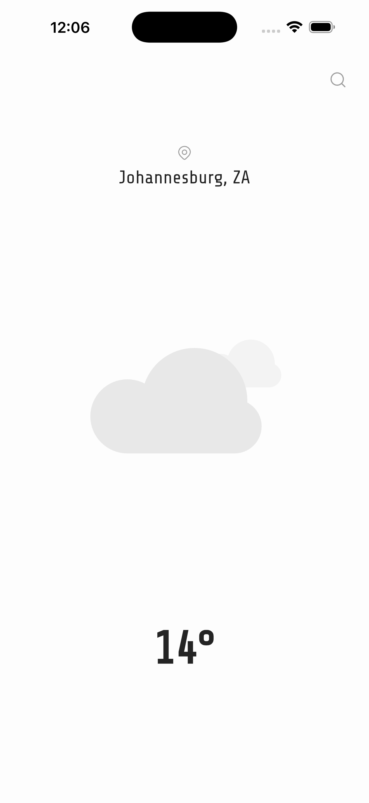
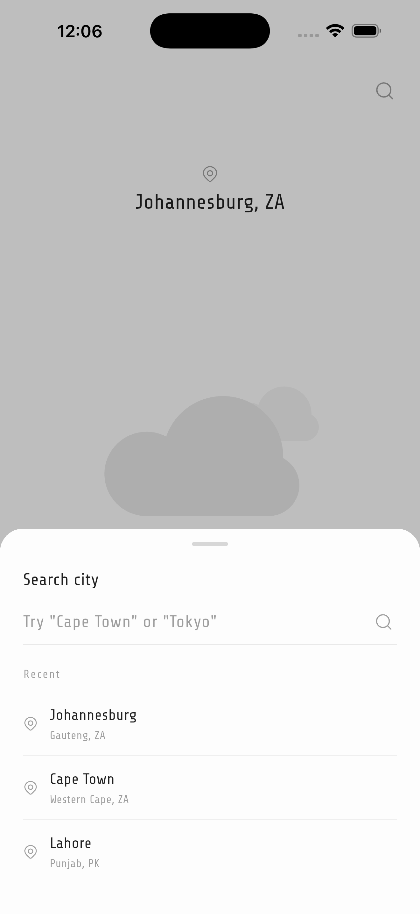

# weatherx

A small Flutter weather app. Detects your current city via GPS, fetches live conditions from OpenWeather, and plays a Lottie animation that matches the sky.

## What it is

- Current location weather on launch (geolocator + reverse geocoding)
- City search with recent searches kept in-session
- Lottie animations for clear, clouds, rain, drizzle, thunderstorm, fog, dust, mist/smoke/haze
- Custom font (`ShareTech`) and a simple light theme

Built with:
- `geolocator` / `geocoding` — current position and city resolution
- `http` — OpenWeather API calls
- `lottie` — weather animations
- `hugeicons` — UI icons

## Planning

Roughly how the code is laid out:

```
lib/
  main.dart                  # MaterialApp + theme
  pages/weather_page.dart    # Home screen + search bottom sheet
  services/weather_services.dart  # OpenWeather + geolocation
  models/                    # weather_model, city_suggestion
  utils/                     # api keys, asset paths, colors, font
assets/                      # *.json Lottie files + fonts/
```

Data flow:
1. `WeatherPage` calls `WeatherServices.getCurrentCity()` on init.
2. City name -> `getWeather(city)` -> `WeatherModel`.
3. Tap the search icon -> bottom sheet -> `searchCities(query)` -> `getWeatherByCoords(lat, lon)`.

## Setup

1. Install Flutter (SDK `^3.10.7`).
2. Get an OpenWeather API key from [openweathermap.org](https://openweathermap.org/api).
3. Copy the template and add your key (this file is gitignored):
   ```bash
   cp lib/utils/api_key.example.dart lib/utils/api_key.dart
   ```
   Then open [lib/utils/api_key.dart](lib/utils/api_key.dart) and replace `YOUR_API_KEY_HERE`.
4. Install deps and run:
   ```bash
   flutter pub get
   flutter run
   ```

Location permission is requested at first launch — required to resolve your current city.

## Screenshots

<p align="center">
  
  
</p>
